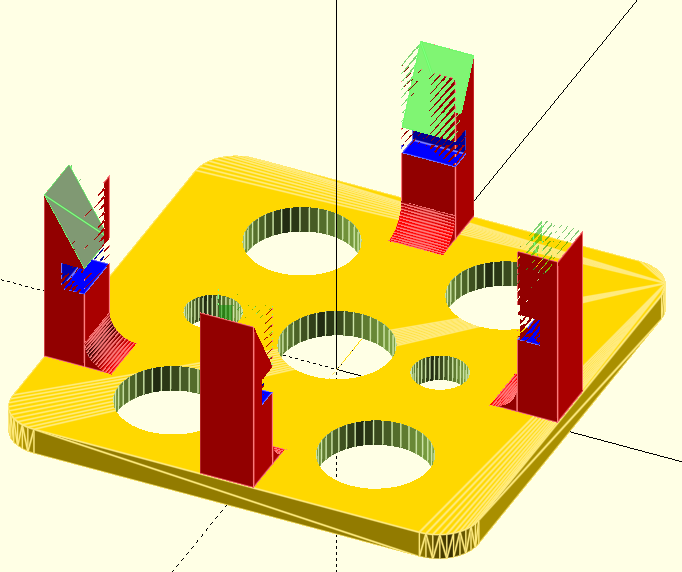

# pcbSnapInMounts

Many off-the-shelf boards are so small that they no longer have mounting holes. Recently, I’ve been encountering this more often. To still be able to mount these boards securely in a project box, I wrote this program. It creates a base plate with mounting holes and so-called **PCB snap-in mounts** that can hold such a PCB in place.

---

## 🧩 Overview

This OpenSCAD script (`pcbSnapInMounts.scad`) generates a **3D printable mounting base** for small PCBs (Printed Circuit Boards) that lack screw holes.

The generated model includes:
- A customizable **base plate** of adjustable size and thickness.  
- **Snap-in mounts** that clip around the edges of the PCB to hold it securely in place.  
- **Mounting holes** so the entire base can be fixed inside your project enclosure.

By modifying a few parameters, you can quickly generate mounts for different PCB sizes and shapes.



---

## ⚙️ How It Works

The script defines several parameters to describe the PCB and the base geometry.  
These are used by the `pcbSnapInMounts()` module to generate the final 3D model consisting of:
1. A flat **base plate**.  
2. Multiple **snap-in clips** positioned around the PCB outline.  
3. Optional **mounting holes** in the base for screws.

Once rendered in OpenSCAD, the design can be exported as an STL and 3D printed.  
The PCB simply **snaps into place** using the printed clips — no screws, glue, or tape required.

---

## 🔧 Parameters

Below is an overview of the most relevant parameters you can configure inside the script:

| Parameter | Description | Default |
|------------|-------------|----------|
| `pcbX` | Width of the PCB in millimeters | 30 |
| `pcbY` | Depth of the PCB in millimeters | 20 |
| `pcbZ` | Thickness of the PCB | 1.6 |
| `snapHeight` | Height of the snap-in clips holding the PCB | 5 |
| `snapThickness` | Wall thickness of each clip | 1.2 |
| `gap` | Clearance between the PCB and clips for tolerance | 0.2 |
| `baseThickness` | Thickness of the base plate | 2 |
| `mountHoleDia` | Diameter of optional mounting holes | 3 |

By changing these values, you can adapt the design for any small module or board you want to mount.

---

## 🖨️ 3D Printing Guidelines

- Print the base **flat on the print bed** for maximum strength and accuracy.  
- Use a **layer height of 0.2 mm** or smaller for precise clip tolerances.  
- Recommended materials: **PLA**, **PETG**, or other slightly flexible plastics.  
- If clips are too tight or too loose, adjust the `gap` value slightly (±0.1 mm).

---

## 💡 Example Usage

In OpenSCAD:

```scad
use <pcbSnapInMounts.scad>

pcbSnapInMounts(
    pcbX = 32,
    pcbY = 22,
    pcbZ = 1.6,
    baseThickness = 2,
    mountHoleDia = 3
);
```
Render (F6) and export the model as STL for 3D printing.

[Download STL file](images/pcbSnapInMounts.stl)

⸻

## 🧱 Applications
- Mounting small sensor or communication modules (e.g., BME280, ESP8266, breakout boards).
- Creating clean, reusable bases for prototype enclosures.
- Replacing messy solutions like tape or hot glue with a simple mechanical mount.
- Custom fixtures for small PCBs without screw holes.

## 📜 License

This project is licensed under the MIT License.
You are free to use, modify, and distribute this software as long as the original license notice is included.

⸻

 Author: Willem Aandewiel (mrWheel)
